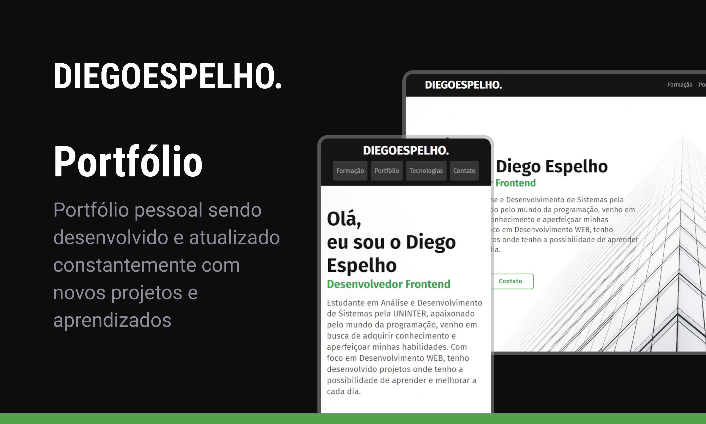

<h1 align="center">Portfólio</h1>

Portfólio pessoal sendo desenvolvido e atualizado constantemente com novos projetos e aprendizados.

  <a href="#-tecnologias">Tecnologias</a>&nbsp;&nbsp;&nbsp;|&nbsp;&nbsp;&nbsp;
  <a href="#-projeto">Projeto</a>&nbsp;&nbsp;&nbsp;|&nbsp;&nbsp;&nbsp;
  <a href="#-layout">Layout</a>&nbsp;&nbsp;&nbsp;|&nbsp;&nbsp;&nbsp;
  <a href="#-licença">Licença</a>

  

 

  

## 🚀 Tecnologias e Ferramentas

Esse projeto foi desenvolvido com as seguintes tecnologias e ferramentas:

## 💻 Projeto

Portfólio pessoal.

- [Acesse o projeto finalizado aqui](https://diegoespelho.github.io/portfolio/)

## 🔖 Layout

O layout deste portfólio foi desenvolvido utilizando a ferramenta de design Figma.

## 📝 Licença

Esse projeto está sob a licença MIT.
